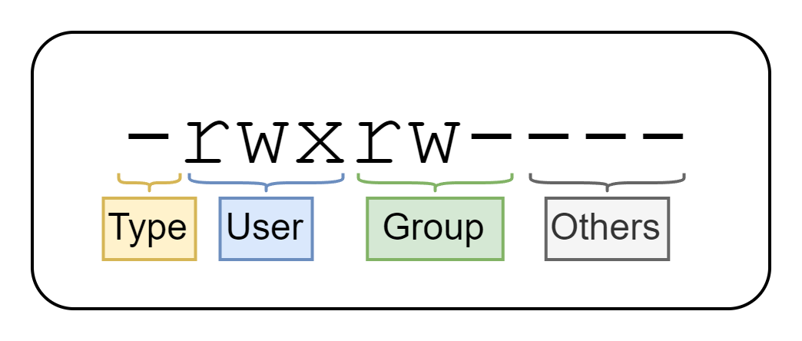
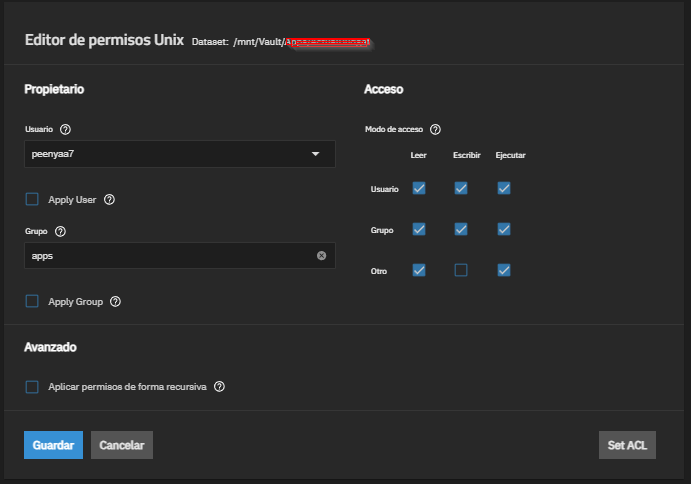
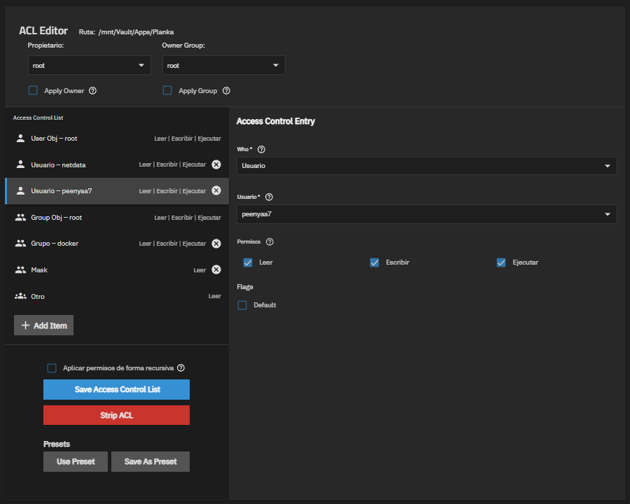
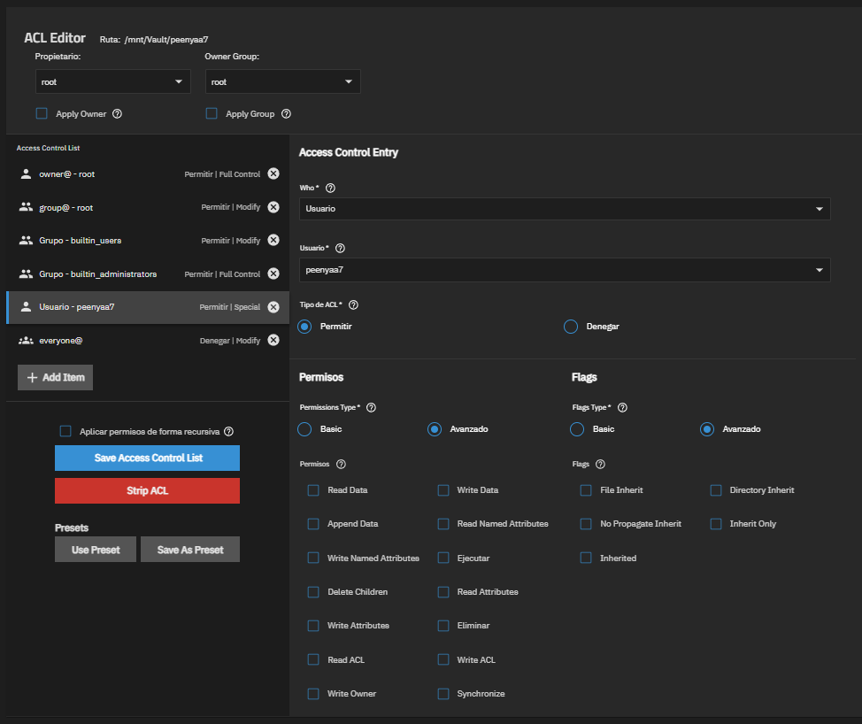

Los permisos es una de las cosas más fáciles de explicar y de entender cuando empiezas en el mundo de los sistemas de archivos, pero también es el causante de la gran mayoría de los problemas cuando compartimos carpetas en red o cuando instalamos una nueva aplicación en nuestro TrueNAS, así que veamos una breve explicación de cada uno de ellos.

(Si quieres saltarte la explicación y ver directamente qué permisos utilizar en cada caso, ve al final del post 😉)

# Permisos UNIX

Estos permisos son los más sencillos de aplicar y por tanto, los más fáciles de entender. Y seguramente, si has jugado alguna vez con sistemas Unix, te hayas cruzado con ellos al listar el contenido de un directorio:

```bash
# Permissions   User        Group       File
-rwxrw----      peenyaa7    devteam     myfile.txt
```

La primera columna del comando `ls` muestra los permisos de cada archivo y se dividen de la siguiente manera:



Como ves, estos permisos se dividen en cuatro partes:
1. `Type` → El tipo de archivo. Los más comunes son `-` (archivo normal), `d` (directorio) y `l` (enlace simbólico). Puedes encontrar la lista completa [aquí](https://en.wikipedia.org/wiki/Unix_file_types#Symbolic).
2. `User` → Los permisos del usuario propietario (`peenyaa7`) en formato `rwx`.
3. `Group` → Los permisos del grupo propietario (`devteam`) en formato `rwx`.
4. `Others` → Los permisos de los demás usuarios, también en formato `rwx`.

Cada conjunto de permisos (`rwx`) se compone de tres letras que representan los siguientes permisos básicos:

| Permiso   | Significado                     |
|-----------|---------------------------------|
| `r`       | Lectura                         |
| `w`       | Escritura                       |
| `x`       | Ejecución/Acceso a carpeta      |

En TrueNAS podemos ver estos tipos de permisos con la siguiente interfaz:



## Ventajas y desventajas

Las ventajas y desventajas de utilizar este tipo de permisos son:

| ✅ Ventajas | ❌ Desventajas |
|-------------|-----------------|
| Simples y rápidos | Solo puedes tener un propietario y un grupo. |
| Funcionan en cualquier sistema UNIX o Linux. | No puedes dar permisos a usuarios específicos adicionales. |
 
# Permisos POSIX ACL

Los permisos POSIX (*Portable Operating System Interface*) es una estándar de la IEEE basado en los permisos UNIX, y como te puedes imaginar, **extienden** el funcionamiento de los mismos.

¿Qué añaden? Además de tener la funcionalidad de los permisos UNIX (`rwxrw----`), son capaces de establecer permisos específicos a cada usuario o grupo de forma independiente, lo que conocemos como ACL (*Access Control List*)

## Estructura de una ACL POSIX

La estructura de una ACL POSIX es bastante sencilla y cada entrada sigue la siguiente estructura:

```bash
# Estructura ACE (Access Control Entry) POSIX:
tipo:identificador:permisos
```

Donde:

| Parte         | Significado                          |
|---------------|--------------------------------------|
| `tipo`        | Puede ser `user` (usuario), `group` (grupo), `other` (otros) o vacío (propietario o grupo propietario). |
| `identificador` | El nombre del usuario o grupo específico. Si `tipo` es `usuario` o `grupo`, puede estar vacío para referirse al propietario o grupo propietario respectivamente. Si `tipo` es `otros` o `mask`, siempre estará vacío. |
| `permisos`    | Los permisos en formato `rwx`.      |

````bash
# Ejemplo de una ACL POSIX:
user::rwx           # Usuario propietario con todos los permisos (rwx)
group::r-x          # Grupo propietario con lectura y ejecución (r-x)
other::---          # Los demás no tienen permisos de ningún tipo (---)
user:peenyaa7:rw-   # Usuario 'peenyaa7' con permisos especiales de lectura y escritura (rw-)
group:devs:r–-      # Grupo 'devs' con permisos especiales de solo lectura (r–-)
mask::rwx           # Máscara de permisos (rwx)
````

## ¿Qué es la máscara de permisos (`mask`) en POSIX ACL?

La máscara de permisos (`mask`) es una entrada especial en las ACL POSIX que actúa como un **filtro** para los permisos efectivos de los usuarios y grupos adicionales (*no propietarios*). Define el máximo nivel de permisos que pueden tener estos usuarios y grupos. Si un usuario o grupo tiene permisos que exceden los definidos en la máscara, esos permisos se reducen al nivel de la máscara.

Por ejemplo, si tienes la siguiente ACL POSIX:

```bash
user::rwx
group::r-x
other::---
user:peenyaa7:rwx
mask::r--
```

En este caso, aunque el usuario `peenyaa7` tiene permisos `rwx`, la máscara `r--` limita sus permisos efectivos a solo `r--` (lectura). Por lo tanto, `peenyaa7` solo podrá leer el archivo, pero no escribirlo ni ejecutarlo.

---

En TrueNAS, puedes ver y editar estos permisos desde la interfaz web:



## Ventajas y desventajas

| ✅ Ventajas | ❌ Desventajas |
|-------------|-----------------|
| Mucho más flexibles. | Más difíciles de leer y entender. |
| Permiten permisos personalizados por usuario o grupo. | Algunos servicios solo usan los permisos UNIX e ignoran las ACL. |
| Compatibles con entornos SMB (Windows). |  |

# Permisos NFSv4 ACL

Los permisos NFSv4 (*Network File System v4*) ACL son una evolución más moderna y se utilizan en entornos más complejos, de hecho, es la opción más avanzada dentro del mundo UNIX/TrueNAS. Además de definir qué puedes hacer, también definen **cuándo y cómo** heredar esos permisos.

Están inspirados en el modelo de permisos de Windows (NTFS), con permisos mucho más específicos y entradas de tipo `ALLOW`/`DENY`.

Cada entrada o ACE (*Access Control Entry*) de una ACL NFSv4 sigue la siguiente estructura:

```bash
# Estructura ACE:
type:flags:principal:permissions

# Ejemplo de una ACL NFSv4:
A:d:peenyaa7@example.es:rwaDxtTnNcCy
A:fd:foxy@example.es:rwaDxtTnNcCy
A:fi:zazu@example.es:rwaDxtTnNcCy
A::OWNER@:rwaDxtTnNcCy
A:g:GROUP@:rxaDxtTnNcCy
A::EVERYONE@:rxtTnNcCy
```

En TrueNAS, puedes ver y editar estos permisos desde la interfaz web, en la sección de permisos avanzados de cada dataset o carpeta compartida:



Para explicar cada parte voy a dividir cada parte en pequeñas secciones para que se entienda mejor 😁

## ACE Type (`type`)

Indica el tipo de ACE que se va a definir, puede ser:
- `A` (Access), `D` (Deny), `U` (Audit) o `L` (Alarm)

## ACE Flags (`flags`)

Indica las marcas ACE que agregan contexto adicional a la ACL. Definen cómo se aplican los permisos y si se heredan o no. Las marcas ACE son:

| Flag | Nombre | Significado |
|------|--------|-------------|
| `f`  | file-inherit | Los **archivos** nuevos tendrán las mismas marcas ACE (`type`, `principal` y `permissions`) excluyendo las marcas de herencia (`flags`). |
| `d`  | directory-inherit  | Los **subdirectorios** tendrán las mismas marcas ACE (`type`, `flags`, `principal` y `permissions`). |
| `n`  | no-propagate-inherit | Los **subdirectorios** tendrán las mismas marcas ACE (`type`, `principal` y `permissions`) excluyendo las marcas de herencia (`flags`). |
| `i`  | inherit-only | Los **archivos** y **subdirectorios** heredarán las mismas marcas ACE (`type`, `flags`, `principal` y `permissions`) pero esta ACE tendrá los `flags` a null. Se utiliza para crear "plantillas" de permisos que heredarán los hijos. |

> Las marcas de herencia (`flags`) estarán **vacías** si el `principal` es un `principal` especial (`OWNER@` u `EVERYONE@`).
> 
> En el caso de que el `principal` sea un **grupo** (`GROUP@` o `group@example.com`), se añadirá la marca `g` (group) a las `flags`. 

## ACE Principal (`principal`)

El `principal` es el usuario o grupo al que está asociada la regla actual (ACE). El `principal` puede ser uno de los siguientes:

| Tipo de principal        | Significado                          |
|------------------|--------------------------------------|
| Usuario específico (`user@example.es`) | Usuario específico al que se le asignan los permisos. |
| Grupo específico (`group@examples.es`) | Grupo específico al que se le asignan los permisos. |
| Usuario propietario (`OWNER@`) | Principal especial. Permisos del usuario propietario. |
| Grupo propietario (`GROUP@`) | Principal especial. Permisos del grupo propietario. |
| Cualquier usuario (`EVERYONE@`) | Principal especial. Permisos de cualquier usuario. |

## ACE Permissions (`permissions`)

Por último, los `permissions` indican el acceso del `principal`. Cada permiso se define con una sola letra:


| Letra | Permiso para archivos | Permiso para carpetas |
|-------|----------------------|-----------------------|
| `r`   | Leer el contenido del archivo | Listar el contenido de la carpeta |
| `w`   | Escribe contenido en un archivo | Crear archivos en una carpeta |
| `a`   | Añadir datos al final del archivo | Crear subcarpetas dentro de una carpeta |
| `x`   | Ejecutar el archivo (si es ejecutable) | Acceder a la carpeta y sus subcarpetas |
| `d`   | Borrar el archivo | Borrar la carpeta |
| `D`   | ❌ *No aplica* | Borrar el contenido de la carpeta (archivos y subcarpetas) |
| `t`   | Leer los atributos del archivo como permisos básicos (no ACLs), propietario, tamaño, etc. | Leer los atributos de la carpeta |
| `T`   | Modificar los atributos del archivo | Modificar los atributos de la carpeta |
| `n`     | Leer los "named attributes", que son metadatos adicionales personalizados (no siempre están presentes) | Leer los "named attributes" de la carpeta |
| `N`     | Modificar los "named attributes" | Modificar los "named attributes" de la carpeta |
| `c`     | Leer la ACL del archivo | Leer la ACL de la carpeta |
| `C`     | Modificar la ACL del archivo | Modificar la ACL de la carpeta |
| `o`     | Modificar el propietario del archivo | Modificar el propietario de la carpeta |

Existen alias (`R`, `W` y `X`) que pueden ser utilizados para simplificar la escritura de permisos, y que funcionan de forma similar a los permisos POSIX ACL:

| Alias | Equivalente completo |
|-------|----------------------|
| `R`   | `rntcy`              |
| `W`   | `waDtTNcCy`          |
| `X`   | `xtcy`               |

## Ventajas y desventajas

| ✅ Ventajas | ❌ Desventajas |
|-------------|-----------------|
| Herencia real de permisos. | Las más difíciles de leer y entender. |
| Control muy granular. | Pueden romperse si se cambian los permisos desde la CLI |
| Traducción directa al modelo de Windows (NTFS). |  |

# Qué permisos elegir en TrueNAS según tu caso

Aunque la opción más flexible (y compleja) es la recomendada por sí en un futuro se quiere extender los permisos, aquí te dejo unos cuantos ejemplos realistas de que utilizar en cada situación si no quieres calentarte mucho la cabeza:

## Caso 1: Carpeta personal en el mismo equipo

En este caso lo recomendado son los *permisos UNIX*, porque es una carpeta donde solo el usuario propietario accederá (y nadie más debería acceder). Además, estos permisos son los mas rápidos y seguros.

```bash
# Ejemplo donde solo el usuario propietario tiene acceso a su carpeta personal:
drwx------  peenyaa7    devteam     /home/peenyaa7
```

## Caso 2: Carpeta compartida en el mismo equipo

Si en un mismo dispositivo se desea que varios usuarios de un grupo concreto accedan a una carpeta, también se recomienda utilizar *permisos UNIX*, ya que estos soportan permisos por grupo y no se necesita permisos específicos por usuario.

> ⚠️ Eso si, si queremos compartirla la carpeta por red en un futuro mejor ver el siguiente caso.

```bash
# Ejemplo donde varios usuarios del grupo 'devteam' pueden acceder a la carpeta compartida:
drwxrwx---  root    devteam     /srv/development
```

## Caso 3: Carpeta compartida por red (SMB)

Si quieres compartir una carpeta por SMB con uno o varios usuarios, lo más recomendable es utilizar *POSIX ACL o NFSv4 ACL* por que puedes asignar permisos específicos a los usuarios/grupos deseados sin modificar los permisos del usuario o grupo propietarios. Además, NTFS (Windows) entenderá correctamente estos permisos y los mostrará de buena manera en la pestaña de “Seguridad”.

(Échale un ojo a la siguiente sección para decidir entre POSIX o NFSv4 😉)

# Problemas de mezclarnos

En TrueNAS, uno de los problemas más recurrentes es mezclar permisos de diferentes tipos entre datasets padre e hijo.

Si tenemos un dataset padre con permisos de un tipo (NFSv4 ACL por ejemplo) y un dataset hijo con otro tipo (POSIX ACL o UNIX), el sistema no sabrá cómo interpretar los permisos heredados del padre y aplicarlos (traducirlos) correctamente al hijo. En este punto, es cuando aparecen los problemas: usuarios con permisos que no pueden acceder (*o aplicaciones que no pueden acceder y no arrancan*), usuarios que se le ha denegado explícitamente un permiso y de repente lo tiene, etc.

> Para ir al grano: mezclar tipos de permisos rompe la coherencia, la herencia y la compatibilidad entre sistemas operativos y la seguridad. **Así que elige siempre un tipo de permiso y mantenlo para todo el árbol de datasets**.

## ¿Cómo sé si tengo que utilizar POSIX ACL o NFSv4?

Para simplificarlo y no rizar más el rizo te voy a dejar un resumen:

| Utiliza POSIX si: | Utiliza NFSv4 si: |
| :---- | :---- |
| Solo necesitas permisos básicos (`rwx`) adicionales para usuarios o grupos | Si compartes por NFSv4 y no por SMB (en este caso es obligatorio utilizar NFSv4)
| No quieres denegar un permisos explícito a un usuario | Necesitas granularidad en tus permisos (por ejemplo, que un usuario pueda crear archivos pero no borrarlos)
| No necesitas herencia compleja | Quieres permisos tipo NTFS y no los básicos (`rwx`) extendidos |

---

Si has llegado hasta aquí, ¡gracias por leerme! Espero que esta explicación te haya ayudado a entender un poco mejor los permisos en TrueNAS y cómo utilizarlos correctamente. Si tienes alguna duda o quieres que profundice en algún tema, no dudes en decírmelo. ¡Nos vemos en el próximo post! 👋