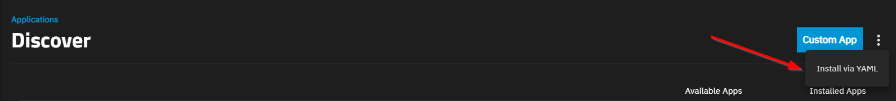
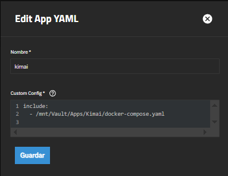

The TrueNAS applications catalog keeps growing, with new apps being added almost every week. Still, there are times when the application we want isn’t available in the official TrueNAS catalog.

There is a GitHub repository where new applications are continuously added to the official TrueNAS catalog, and anyone can suggest new apps to be included (through a new Issue).

Here’s the link: https://github.com/truenas/apps 😉

# Options to Install Docker Applications in TrueNAS

For cases where the app you want isn’t in the catalog, TrueNAS allows us to install Docker applications in two different ways:

1. A custom container (*Custom App*):

    

2. A container through a `docker-compose.yml` file (*Install via YAML*). In this post, we will focus on this option:

    

When selecting the last option (*Install via YAML*), TrueNAS opens a text editor where we can paste the contents of the `docker-compose.yml` file we want to use to deploy our application. However, sometimes this file can be quite long or complex, making it difficult to manage inside the TrueNAS editor.

When I first started using TrueNAS, I used to modify each application's `docker-compose.yml` file to adapt it to TrueNAS. But over time, I discovered a much simpler and more elegant way to do it, which is the whole point of this post: **using the `include` directive**.

# The Tip: Use the `include` Directive in the TrueNAS Interface

The `include` directive allows us to import the contents of another YAML file inside our main `docker-compose.yml`. This way, we can keep a very simple and clean main file that just references our real configuration file (no matter how complex it is).

For example, suppose we want to install an application (*Kimai*, for instance). Instead of copying and pasting the entire `docker-compose.yml` file into the TrueNAS editor, we can download the file into a dataset in our TrueNAS system (for example: `/mnt/Vault/Apps/Kimai/docker-compose.yml`), and then reference it in the TrueNAS YAML editor using the `include` directive like this:



> ⚠️ Remember that the path must be absolute and accessible from TrueNAS

With this approach, the file we paste into the TrueNAS editor stays simple and clean, and we can manage the real `docker-compose.yml` file independently and more comfortably, which gives us several advantages:
- Keep the `docker-compose.yml` file **exactly as the developer provides it**, without having to tweak it for the TrueNAS editor.
- Edit the `docker-compose.yml` with your **favorite text editor**, with syntax highlighting, autocompletion, auto-indentation, etc.
- Keep the application's **`.env` file** (if any) in the same directory as the `docker-compose.yml`, making environment variables and credentials easier to manage.
- Store both the `docker-compose.yml` and the application data in the same dataset, which allows you to **take snapshots and perform rollbacks** of the application version *together with its data* if needed.

# How I Organize My Docker Applications in TrueNAS

In case you're curious, here’s the folder structure I use for each of my Docker application datasets in TrueNAS:

```bash
/mnt/vault/apps/myapp/
├── docker-compose.yml
├── .env
├── folder1/ # Application volume 1
├── folder2/ # Application volume 2
└── ... # Additional volumes/data if required
```

> Keeping the same structure for all the Docker apps I install in TrueNAS helps me keep everything organized and easy to manage.

---

I hope this small tip helps you manage your Docker applications in TrueNAS more efficiently. See you in the next post! 🚀