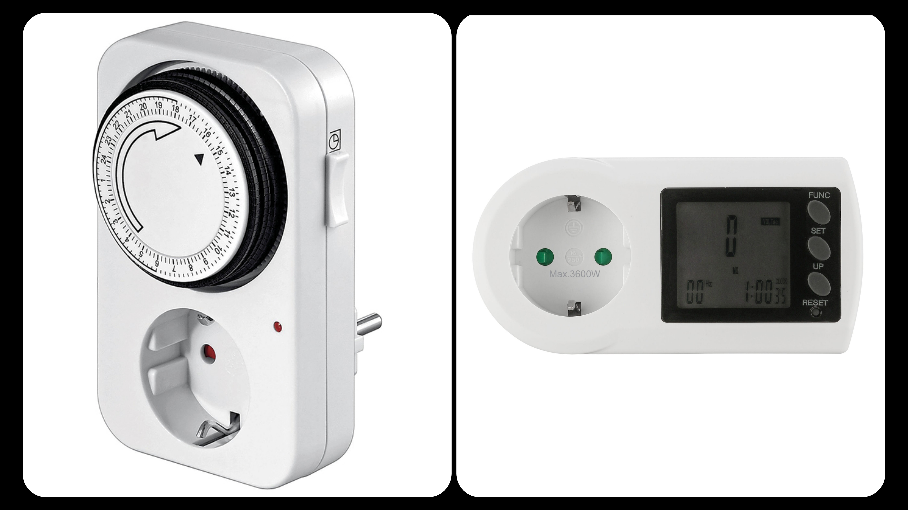
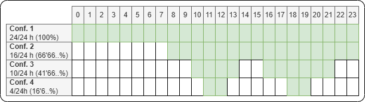
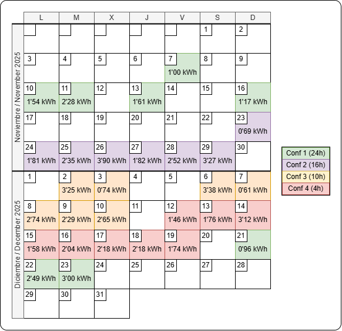

Every Christmas, I see the same kind of videos on social media with the same viral advice:  
“*Did you know you can save a lot of money by turning your water heater on only when you need it?*” or  
“*Your water heater is draining your wallet and you don’t even know it…*”.

As someone passionate about technology and efficiency, I decided to stop guessing and start measuring real data. I spent several weeks analyzing real consumption in my own home, and here are the results. **How much truth is there behind these videos?**

# The lab: Devices used

To run the tests, I bought two simple but effective devices:

- **Analog timer**: allows me to program the exact on/off hours of the water heater  
- **Energy consumption meter**: allows me to measure how much energy the heater actually uses  

Here is a photo of the devices I used:

> Although energy meters usually show many values, in this analysis we will focus exclusively on **kilowatt-hours (kWh)** per day, which is what we actually pay for on our electricity bill.

# The experiment: Configurations

Over several weeks, I recorded the daily consumption at the same time every day. I rotated between four different configurations to see which one best fit my lifestyle and, above all, which one was more efficient.

The four configurations were:

# Results: Daily consumption and savings

After several weeks of testing, these are the results:

After processing the data, if we calculate the average daily consumption and the cost of each configuration, we get the following summary table:

| Configuration | Average consumption (kWh) | Cost per day (€) | Cost per month (€) | Cost per year (€) |
| :------------ | :------------------------ | :--------------- | :----------------- | :---------------- |
| **1** *(24h)* | 1'756 kWh | 0'246€ | 7'38€ | 89'73€ |
| **2** *(16h)* | 2'337 kWh | 0'327€ | 9'82€ | 119'42€ |
| **3** *(10h)* | 2'237 kWh | 0'313€ | 9'40€ | 114'31€ |
| **4** *(4h)*  | 2'008 kWh | 0'281€ | 8'43€ | 102'61€ |

> **Note 1**: The electricity price used in these calculations is **0'14 €/kWh**, since the average cost of my latest electricity bills was 0'1393 €/kWh.  
>  
> **Note 2**: Monthly and especially yearly costs are **approximate**. These values are based on average daily consumption during the coldest months of the year, so the real annual cost may be lower.

## Which configuration is the most cost-effective?

If we look at the results, surprisingly **the most cost-effective configuration is configuration 1** (the 24h one). But shouldn’t it be the most expensive if it is running all day? What is going on?

The answer lies in how electric water heaters work.

A water heater does not heat water continuously. It only turns on when the water temperature drops below a certain threshold. If the insulation is good, it only provides small “heat boosts”.

When the heater is turned off for many hours, the water cools down completely or almost completely. When it is turned back on, it needs a large and sustained energy spike to heat 50, 80, or 100 liters of water. In my case, that spike consumed more energy than the small daily maintenance cycles.

## So… is it worth turning the water heater off?

Like most things in life, there is no single right answer for everyone. What represents significant savings for one home might be a constant nuisance for another with no financial benefit.

The answer for your specific case will depend on:
- **Number of people in the house**: The more people at home, the higher the demand for hot water, and the longer the heater will need to stay on.
- **Personal habits**: If the household follows a strict routine, a timer might be beneficial. However, if habits are unpredictable, someone might end up taking a cold shower more than once.
- **Heater insulation**: This is the most important technical factor. Modern heaters have excellent insulation that keeps water hot for hours. Older heaters don't insulate as well, causing the water to cool down faster (you can tell if your heater "feels hot" to the touch from the outside).
- **Electricity plan**: If you have a **Time-of-Use (TOU) rate**, delaying the heating process to the cheapest hours can be beneficial. Without a TOU rate, the savings may be negligible.
- **Comfort threshold**: Are you willing to sacrifice the immediacy of hot water to save a few euros a month? If you don't mind planning your showers or risking running out of hot water unexpectedly, then programming is for you.

# Conclusion

In my household (2 people, regular habits, and a flat-rate electricity plan), **it is not worth turning it off**. The savings are non-existent or so low that they don't compensate for the risk of running out of hot water mid-shower.

The *only advantage* I have found during this experiment is using the timer to turn off the heater during peak demand moments (like when cooking) to avoid tripping the circuit breaker.
