Hello! Today I want to revisit the assembly guide for a custom keyboard that I made some time ago so that it's available on the blog and anyone can access it more easily.

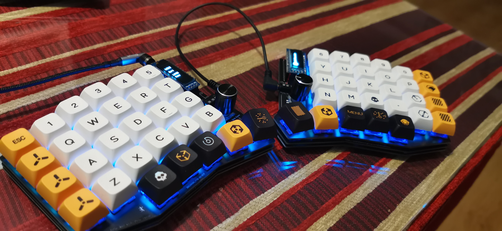

In this guide, you will find: the necessary components, the assembly guide (with photos), cost, tips, and troubleshooting for making this keyboard from scratch.

The name of the keyboard is *SofleRGB v2.1*, although in the guide we will refer to it as *Sofle*.

# Before you begin

## Concepts used in this guide

I would like to start with this section to **clarify each concept** used in the guide. Most of the terms used in the guide are used in a standardized way, but not all of us are experienced electronics engineers, so I will provide a definition for each concept so that anyone can make their own keyboard from scratch.

> **If you don't understand a concept, come back to this section 😉**

### Pads and Silkscreen

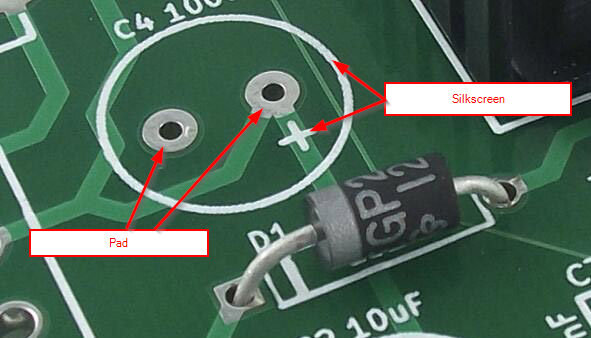

- **Pads**: These are the soldering points on the PCB.
- **Silkscreen**: This is the screen printing that appears on the PCB and indicates the correct position of the components.

### Pin Header and Socket Header

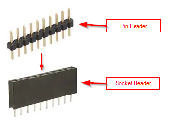

- **Pin Header**: This is the component that is commonly soldered to a component and allows us to connect it to the Socket Header on the PCB.  
- **Socket Header**: This is the component that is commonly soldered to the PCB and allows us to make another component interchangeable. In this case, the Socket Header allows us to connect the Promicro to the PCB without having to solder. This allows us to change the Promicro if it breaks without having to desolder anything.

### Top and bottom of the PCB

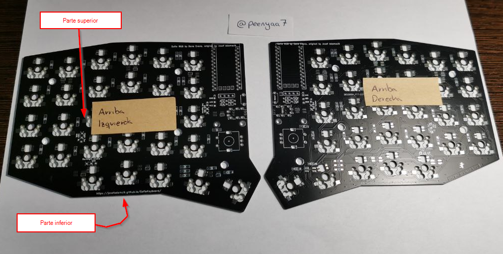

- **Top of the PCB**: This is the side of the PCB that is *not* in “contact” with the table when the keyboard is assembled. This side contains the components that are visible from above (OLED screen, encoders, etc.).  
- **Bottom of the PCB**: This is the side of the PCB that *is* in “contact” with the table when the keyboard is assembled. This side contains the components that are not visible from above (diodes, LEDs, etc.).

## Ways to assemble the keyboard

Since some components are bulkier than others, we can assemble the keyboard in two different ways depending on how comfortable we want to be:

- **The safe way**: It consists of *first soldering the essential components*, installing the firmware to verify that everything is correct, and then soldering the optional components onto something that works. This way, you can check halfway through that everything is working correctly and fix it if necessary. This method is more difficult to solder because the Promicro gets in the way from the start, but it is the safest way to assemble the keyboard.  
- **The convenient way**: It consists of soldering the components in such a way that *the soldering is as simple as possible*. This way, you can solder the optional components without having to solder the Promicro. It is less difficult to solder, but it can be a real headache if you make a mistake.

In my case, I followed the **second (easy) method**, as it was my first time soldering and I wanted the process to be as simple as possible.

## My configuration

The *Sofle* allows for various configurations (*you can assemble components optionally*) and each one may require a slightly different assembly process. In my case, I have opted for the following configuration:

- ✅ With OLED screens
- ✅ With encoders (rotary potentiometers)  
- ❌ Without layer indicator LED
- ✅ With underglow LEDs
- ✅ With backlight LEDs

## How to solder

Before attempting to solder the *Sofle*, I recommend practicing your technique with a practice board like this one:

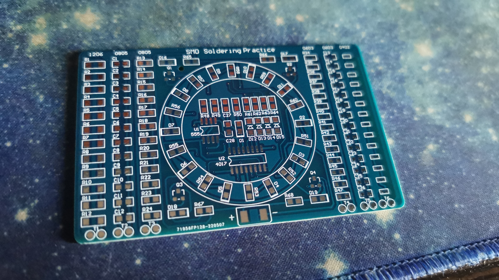

It is inexpensive and can help you take your first steps in the world of micro-soldering.

The most reliable technique you can use to solder the different components is as follows:

1. Apply a little solder to a pad on the PCB and let it harden.  
2. Bring the component closer (holding it with tweezers or similar), pressing lightly with the pin you want to solder to the freshly applied solder.  
3. Apply heat to the freshly applied solder until it melts.
4. Once the component is in the desired position, move the soldering iron away and continue to hold the component until the solder hardens.
5. Now that the component is held in place by the first pin, apply solder to the other pins of the component.

The technique of soldering to a single leg is called “tacking.”

> ⚠️ If the component is electrical (diodes, LEDs, promicro), you must be more careful, as there is a risk of burning the component inside and rendering it unusable. Always try to solder the opposite pins of the components so as not to overheat the same area.

There are many video tutorials on the internet that can help you visually understand how to do this. In the [References](#references) section, I have included a couple of links with best practices for micro-soldering. **Take a look**.

## Tips

The tips I'm going to give you are very obvious, but it doesn't hurt to remember them. These are the tips I followed, and they helped me avoid mistakes when assembling the keyboard.

- **Mark everything**: It's highly recommended to mark each half of the keyboard (top left, top right, etc.). This keyboard has reversible PCBs to make the manufacturing process more economical, but this makes assembly confusing because each half has holes and markings on both sides. Following this tip will help you avoid mistakes when assembling the keyboard.  
- **Don't rush:** Take your time assembling the keyboard and don't rush. Making a mistake when soldering can be an irreversible problem.  
- **Check everything**: Before you start soldering anything, check that everything is correct. If you are unsure, don't do it.  
- **Do your research**: Before you start doing anything, don't hesitate to do your research. Again, if you are unsure about something, don't do it.

# Components and cost

During the component purchasing process, several of us got together to buy components in bulk and thus lower the price. That's why you'll see that I identify them in the comments as part of a ‘**joint purchase**’.

The prices you'll see in the following table **DO NOT** include shipping costs.

| # | Required | Component | Quantity | Total price | Comments |
| :---- | :---- | :---- | :---- | :---- | :---- |
| 1 | ✅ | **PCB, top plate, and bottom plate** | 2 | €4.32 | Purchased as part of joint purchase order from [JLCPCB](https://jlcpcb.com/) |
| 2 | ✅ | **M2 screw (3mm)** | 28 | €0.66 | Purchased in joint purchase |
| 3 | ✅ | **M2 spacer (3mm)** | 14 | €0.95 | 50 units purchased on AliExpress |
| 4 | ✅ | **1N4148W diode** | 60 | €0.92 | Purchased as part of a joint purchase |
| 5 | ❌ | **SK6812 Mini LED (3535)** | 72 | €4.44 | Purchased as part of a joint purchase |
| 6 | ✅ | **Kailh Hotswap Socket** | 58 | €8.44 | Ordered on AliExpress. |
| 7 | ✅ | **Akko CS Lavender Switch (tactile)** | 58 | €24.51 | Ordered on AliExpress. The price is for 2 boxes of 45 switches each. |
| 8 | ✅ | **Keycap** | 58 | €20.05 | Ordered on AliExpress. The price is for a complete pack of English keycaps. |
| 9 | ✅ | **Promicro USB-C with pin header** | 2 | €11.03 | Ordered from AliExpress. |
| 10 | ❌ | **Socket Header for the promicro (12 pins)** | 4 | €0.45 | Ordered from AliExpress. |
| 11 | ✅ | **Magnetic USB-C cable** | 1 | €2 | Ordered from AliExpress. You can use any simple cable you have at home. |
| 12 | ✅ | **128x32 OLED screen with pin header** | 2 | €3.53 | Ordered from AliExpress. |
| 13 | ❌ | **Socket Header for OLED screen (4 pins)** | 2 | $1.00 | Purchased at a local store. I had to cut a longer one. |
| 14 | ❌ | **RESET button** | 2 | $0.33 | Purchased as part of a joint purchase. |
| 15 | ❌ | **EC11 Potentiometer/Encoder** | 2 | €2.20 | Ordered from AliExpress. The price is for 5 potentiometers. |
| 16 | ❌ | **KNOB for EC11 encoder** | 2 | €0.70 | Ordered from AliExpress. The price is for 5 KNOBs. |
| 17 | ✅ | **TRRS connector** | 2 | €0.54 | Purchased as part of a joint purchase. |
| 18 | ✅ | **TRRS cable** | 1 | €1.51 | Ordered from AliExpress. |
| 19 | ❌ | **Rubber foot** | 10 | €1 | Purchased at a local bazaar. |
| 20 | ❌ | **Case** | 1 | €12.64 | Ordered from AliExpress. |
|    |     | *TOTAL* | | *€101.22* |     |

# Process

As I mentioned earlier, I chose to assemble the keyboard in a **comfortable way**. If you want to follow the safe way, you'll have to adapt the process a little. That said, let's get started!

## 01. Diodes

Diodes are small components that allow current to flow in only one direction. In keyboards, diodes are used to *prevent ghosting*, which is when several keys are pressed at once and the keyboard does not detect them correctly.

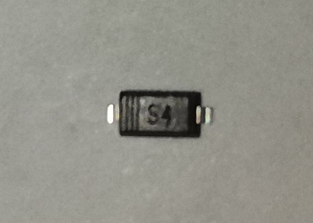

The diodes are soldered to the **bottom** of the PCBs. Keep in mind that the diodes have **only one correct position**, because if they are placed upside down, they will not work properly.

Each diode usually has a small mark indicating the *cathode* of the diode; here is a summary diagram of the correct position of the diodes:

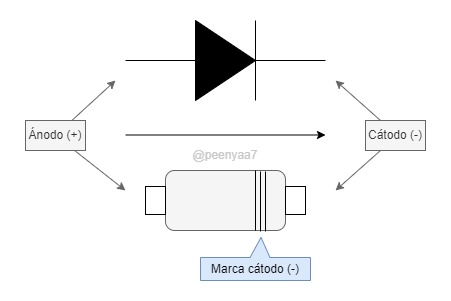

On the PCB, at each diode position, there is a small mark indicating the correct position of the diode:

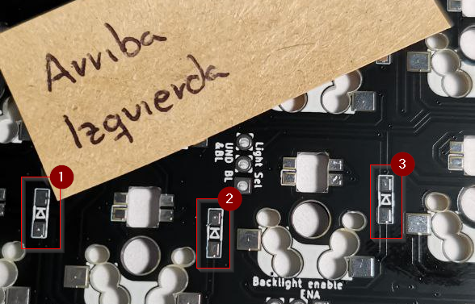

The official guide states that 58 diodes are required, but in my case I used 60 diodes (30 on each half). I don't know if this is an error in the official guide.

As a tip, I recommend separating 30 diodes per half before you start soldering, as it is very easy to get confused and solder one diode too few or too many.

## 02. LEDs

⚠️ If you are not going to put LEDs on your *Sofle*, you can go directly to the section [LED jumpers](#03-led-jumpers).

LEDs are those little lights that add an aesthetic touch to our keyboard.

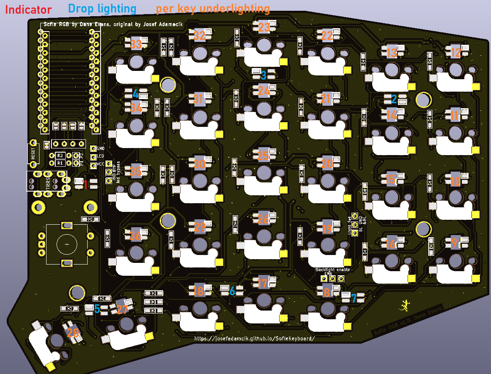

This guide distinguishes between three types of LEDs:

- **Indicator LED** (🔴): There is one LED for each half, marked in red in the image above. It is located at the top of the PCB, right next to the TRRS. In my case, I have chosen not to use it, as I do not see it as necessary (all the information it provides can be found on the OLED screen).  
- **Underglow LEDs** (🔵): There are 6 LEDs for each half, marked in blue in the image above. They are located at the bottom of the PCB. They are surface mounted, which makes the soldering process more complicated.  
- **Backlight LEDs** (🟠): There are 29 LEDs on each half, marked in orange in the image above. They are located in the holes on the PCB, just below each switch. They are embedded, which makes the soldering process easier. These LEDs are also known as *in-switch LEDs* or *per-key LEDs*.

The LEDs used by *Sofle* are SK6812 Mini LEDs, but be careful because there are different variants, so you have to make sure that the ones you buy follow the following diagram:

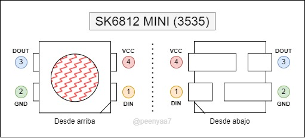

### Before soldering the LEDs

I consider this section very important for LEDs, and I will use it to give some important warnings:

- The PCB silkscreen marks the **DOUT pin**, so don't be confused into thinking that it marks the VCC pin. Furthermore, it does not necessarily coincide with the notch on the LED: 
    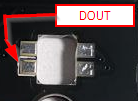
- Before soldering an LED, double-check that it is in the correct position. Believe me, it is very easy to mistake an LED for being in the correct position when it is not.  
- LEDs are very sensitive to temperature, and it is very easy to burn them if you are not careful (a temperature of 240/260ºC is enough).
- Sometimes, an LED may arrive with two broken corners, and you may confuse those corners with the LED notch. It is advisable not to use these types of LEDs if you have spare LEDs.

### Soldering the backlight LEDs

These LEDs illuminate each of the keys. They are located on the **bottom of the PCB** (facing upwards) just below each switch and are the easiest to solder, as they do not need to be held in place (they fit into the hole in the PCB).

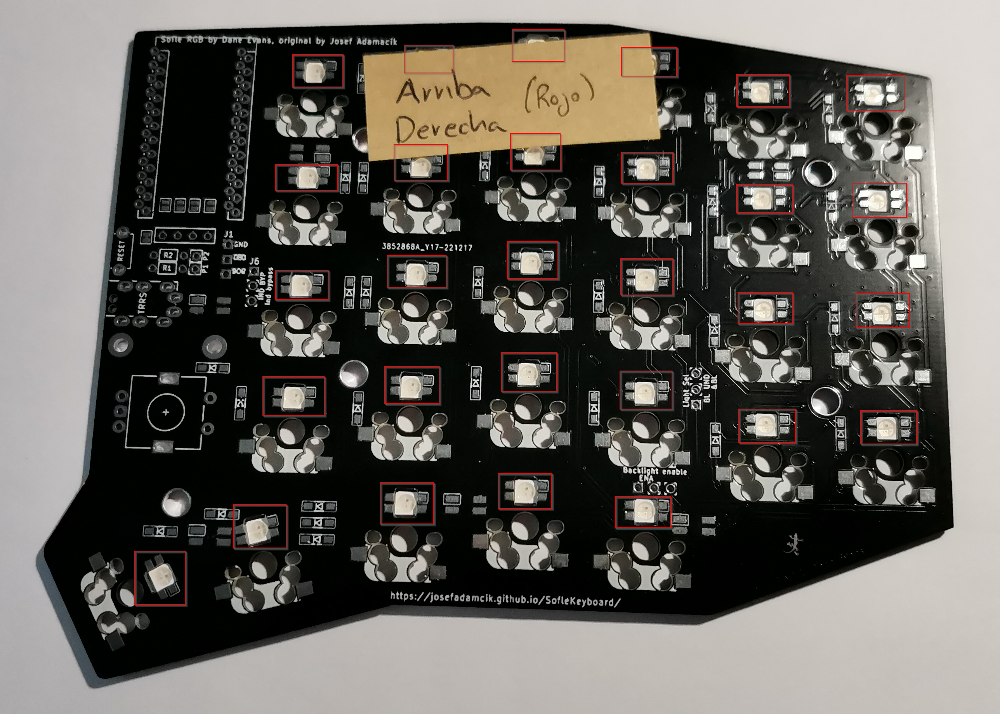

To solder these LEDs, you have to follow a slightly different method than usual. Once you have the LED fitted into the hole in the PCB (in the correct position), you need to apply enough solder to one of the pads on the PCB and then drag the tip of the soldering iron from the pad with the solder to the LED (without releasing the tip of the soldering iron). This way, you “drag” the solder from the pad to the LED, creating a kind of drop:

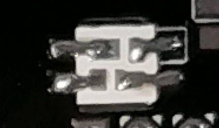

> It is advisable to only make one pad for each LED, as if we make two pads at the same time, it is very likely that the LED will burn out. Once we have the first pad for each LED, we can make the second pad for each LED (in the same order).

### Soldering the underglow LEDs

These LEDs illuminate the underside of the keyboard (lighting up the table). They are located at the **bottom of the PCB** and, unlike the previous ones, are the most difficult to solder as they are surface-mounted and must be held in place with tweezers.

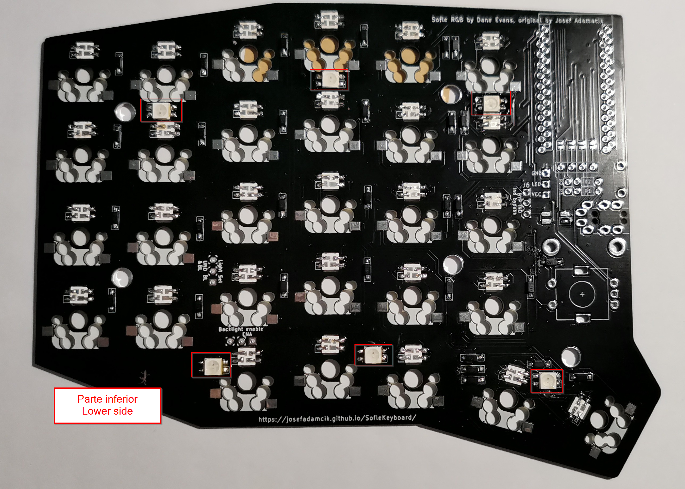

These LEDs follow the normal soldering process, but they are difficult to solder because their pins are very short.

> **🦸 Pro tip**: If the first pad we solder on each of the LEDs is the DOUT pad, we are ensuring that if, in the future, an LED does not light up correctly, it is because the DIN pin on the LED is not working properly.

## 03. LED jumpers

Since the *Sofle* allows us to choose between different LEDs, we have to close the LED jumpers based on the LED configuration we have chosen.

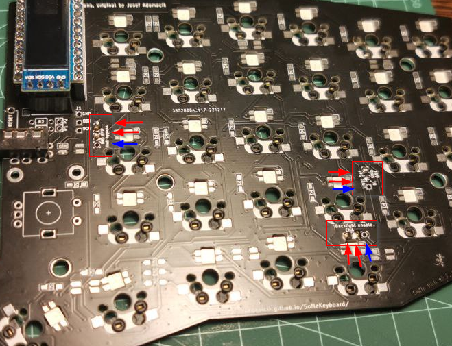

> ⚠️ In the photo, the jumpers are photographed from the top, but the jumpers **are soldered on the bottom** of the PCB.

As shown in the image above, there are a total of 3 jumpers (`j6`, `j4`, and `j5`) on each half of the Sofle:

- **Indicator bypass (`j6`)**: Located right next to the Promicro. It must always be soldered (unless we don't want any LEDs on our *Sofle*). This jumper indicates whether or not we want the indicator LED.  
- **Light Selector (`j4`)**: Located in the center of the PCB. This jumper indicates whether or not we want underglow LEDs.
- **Backlight Enable (`j5`)**: Located in the center of the PCB. This jumper indicates whether or not we want backlight LEDs. This jumper does not need to be soldered if we do not have underglow LEDs.

Below is a table showing the connections that must be made at each of the jumpers according to the desired LED configuration (if there is no connection, nothing should be soldered):

| Do you want an indicator LED? | Do you want an underglow LED? | Do you want a backlight LED? | Jumper `j6` | Jumper `j4` | Jumper `j5` |
| :---- | :---- | :---- | :---- | :---- | :---- |
| ❌ | ❌ | ❌ |  |  |  |
| ❌ | ❌ | ✅ | 1-2 | 1-2 |  |
| ❌ | ✅ | ❌ | 1-2 | 2-3 |  |
| ❌ | ✅ | ✅ | **1-2** | **2-3** | **2-3** |
| ✅ | ❌ | ❌ | 2-3 |  |  |
| ✅ | ❌ | ✅ | 2-3 | 1-2 |  |
| ✅ | ✅ | ❌ | 2-3 | 2-3 |  |
| ✅ | ✅ | ✅ | 2-3 | 2-3 | 1-2 |

I have marked my configuration in the table above, and the image in this section also shows the bridges I have soldered following the instructions for my configuration.

> **🦸 Pro tip**: I recommend using a piece of wire cut to size (U-shaped) to make the connections on each of the bridges. This will allow us to make cleaner, easier, and safer connections.

## 04. Kailh Hotswap

This component allows us to insert and remove switches from our keyboard as many times as we want without having to solder them. It is located right where the switches are placed, and they are soldered to the **bottom of the PCB**.

They are very easy to solder, as they are not electronic components and have a large contact surface with the PCB. I recommend applying solder to the pad, placing the hotswap on top, and pressing down on the hotswap pin with the soldering iron until the solder underneath the component melts.

However, although they are easy to solder, it is also easy to get confused for two reasons:

- Because the PCBs are reversible.  
- Because we can accidentally cover the hole where the switches will go.

Below is a *small diagram* of how to place the component (on the right side as an example) and what each hole is for:

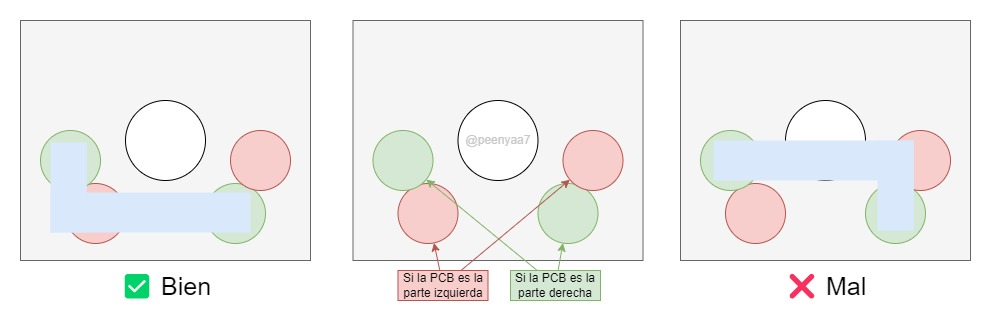

## 05. RESET button

This component is completely **optional**, but I highly recommend it, especially if you have never had a keyboard like this or never configured *QMK*.

This button is soldered to the **top of the PCB** and allows you to enter RESET mode so you can load your own firmware onto the keyboard. If you don't want to install the button for whatever reason, you can always make a small bridge with a wire whenever you want to change the keyboard settings.

Each half of the *Sofle* requires 1 RESET button, located just above the TRRS:

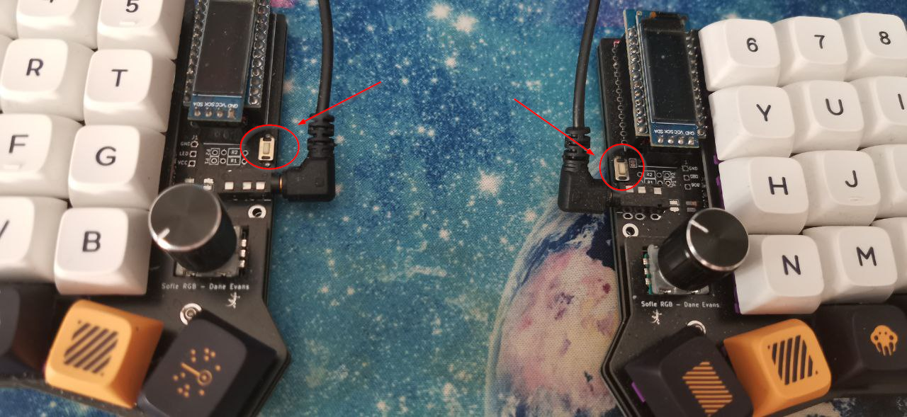

It is a very simple component to solder, but it is very likely to become crooked if not done carefully. If it does become crooked, nothing will happen, but it will not look as nice as it could.

## 06. TRRS

This component allows us to connect the two halves of the keyboard. It is located at the **top of the PCB**, right next to the reset button.

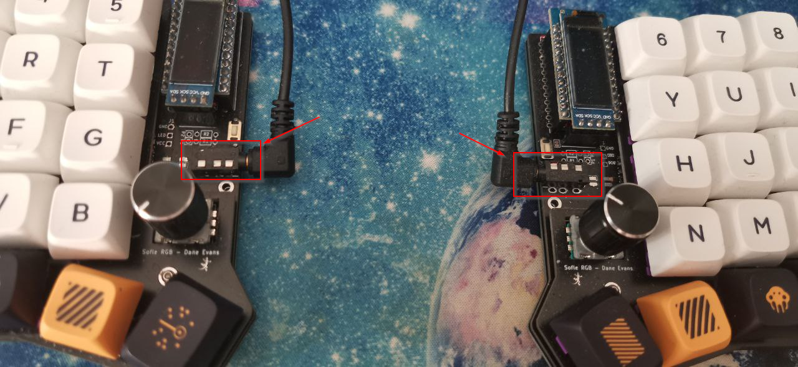

TRRSs are very easy to solder, as they are not electronic components and have a large contact surface with the PCB. However, keep in mind that, since the PCB is reversible, they must be soldered in the correct position. Note that they are completely opposite:

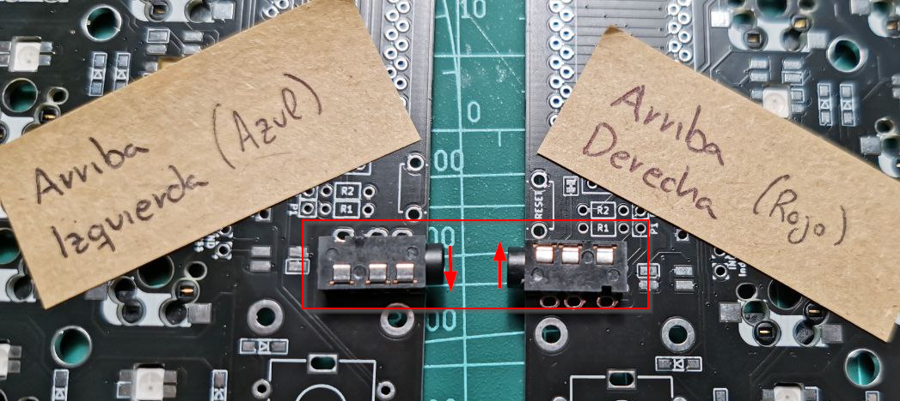

When soldering, I recommend using tweezers to hold the component with the PCB so that you can solder the pins underneath without any problems.

## 07. OLED Bridges

The OLED bridges indicate where (top or bottom) the connected OLED screen will go (remember that the PCB is reversible), so they should be soldered **only on the top of the PCB**, which is where the OLED screen will go.

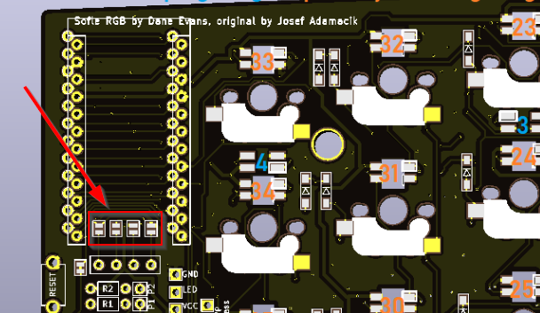

Since these bridges will be hidden under the Promicro and the OLED screen, it is best to make this connection now.

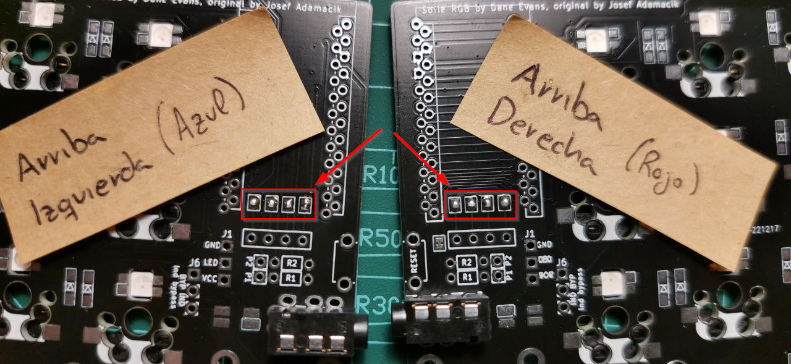

## 08. Promicro Socket Headers

The Promicro Socket Headers are an **optional** component, but one that I highly recommend. They allow us to connect the Promicro to the PCB without having to solder, making it possible to replace it if it breaks without having to unsolder anything.

The promicro Socket Headers are located at the **top of the PCB** and are clearly marked in the following area:

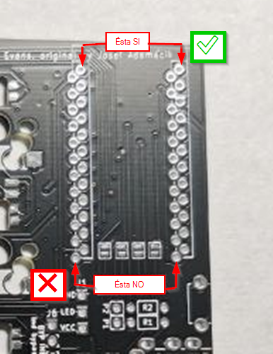

In the image above, I have marked which line of pads should be soldered. Although it is very easy to solder as there is no risk of burning any electrical components, it is very easy to make a mistake, especially because when soldering on the other side, you would be soldering visually on the “wrong side” even though this is not true.

To avoid confusion, keep in mind that the *Socket Headers must hide the PCB silkscreen*, as shown in the following image:

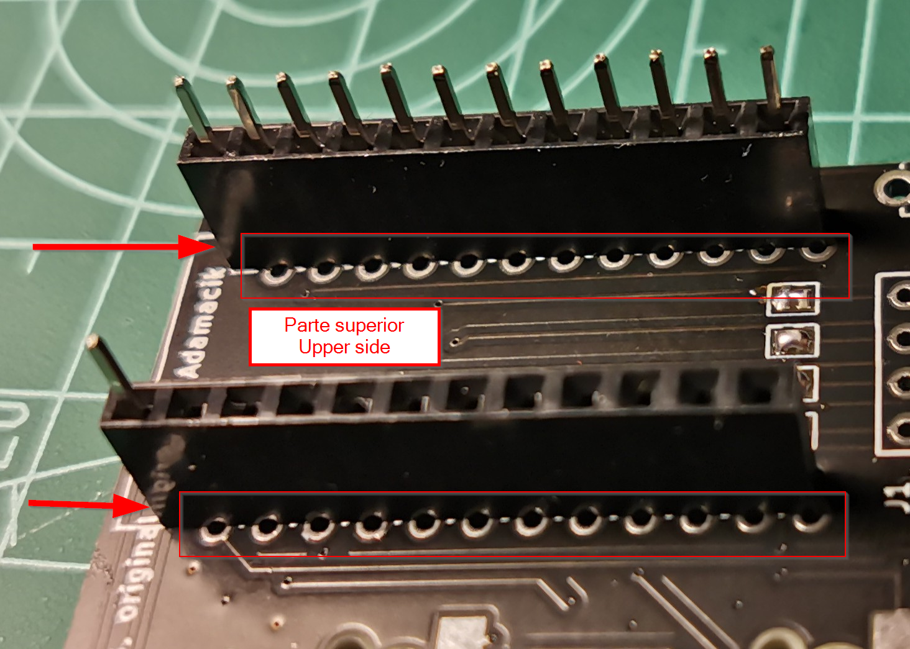

And on the other side, as I mentioned, the solder joints should be on the “wrong side.”

## 09. Promicro

The Promicro is the controller or brain of our keyboard, which will receive all commands and communicate with the computer correctly.

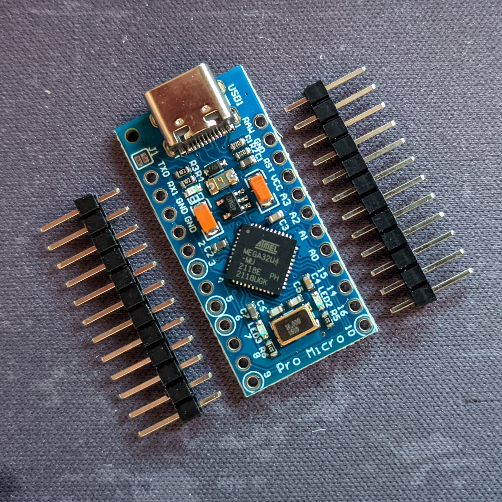

It is located at the **top of the PCB**, right where we previously placed the Promicro socket headers.

> ⚠️ Check what type of USB your Promicro uses. In my case, it is USB-C.

### Modifying the Promicro Pin Header

If we want to have a removable OLED screen that is securely attached to our Sofle, we need to make a small modification to the Promicro Pin Header.

The steps are as follows:

1. To do this, we must remove all the pins from the Pin Header:
   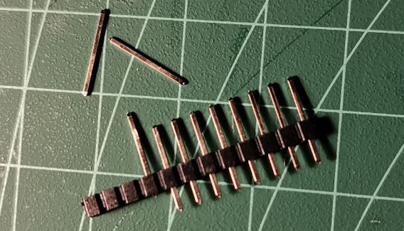 
2. Place all the extracted pins in the Promicro's socket header  
   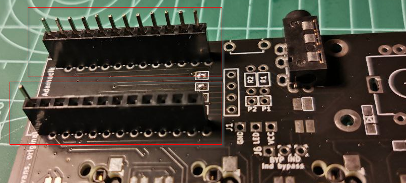
3. Place the Promicro, with all the chips hidden, and solder the pins one by one to the Promicro (soldering opposite pins each time to avoid overheating).  
   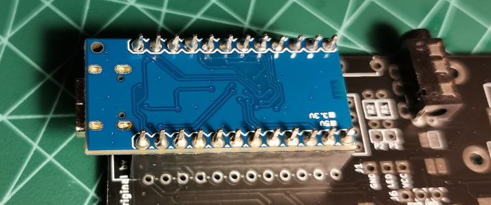
4. (Optional) Cut off the excess from the Promicro pins for a more aesthetic look.
5. Remove the Promicro from the Socket Header so that it does not interfere with the following steps.

## 10. OLED screen socket headers

As with the other socket headers, this is an **optional** but highly recommended component (although *if you have installed the Promicro socket headers, this step becomes mandatory*).

It is located at the **top of the PCB**, just below the Promicro:

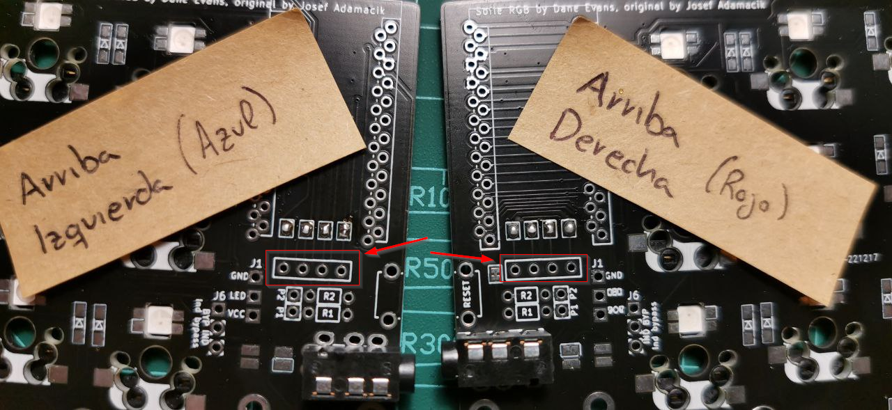

The soldering process is straightforward and has little margin for error. After soldering, it should look something like this:

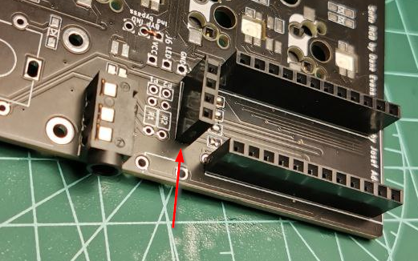

## 11. OLED Screen

The OLED screen is the component where we can display all kinds of information we want (we will see how to do this in future articles).

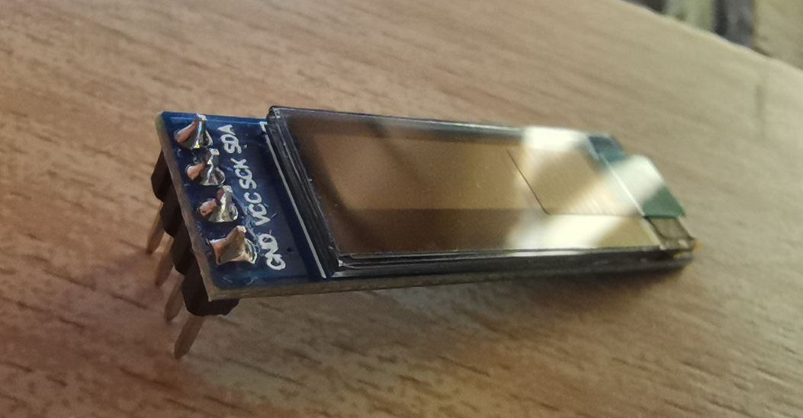

It is located at the **top of the PCB**, fitting the screen into the OLED screen's Socket Header.

Normally, when you purchase an OLED screen, it comes with the pins already soldered, so no soldering is required. If your OLED screen comes without pins, you will need to solder it to the corresponding pin header.

## 12. Encoders

Encoders are a component that adds extra functionality to the keyboard. In addition, *we don't lose the keystroke* because encoders have keystrokes. In my case, I will use them to:

- Change the color and brightness of the LEDs
- Modify the volume of the computer
- Play/Pause music by pressing the encoder
- Take a screenshot by pressing the other encoder
- Move between characters/words within a text
- ...

They are located at the **top of the PCB**, just below the TRRS:

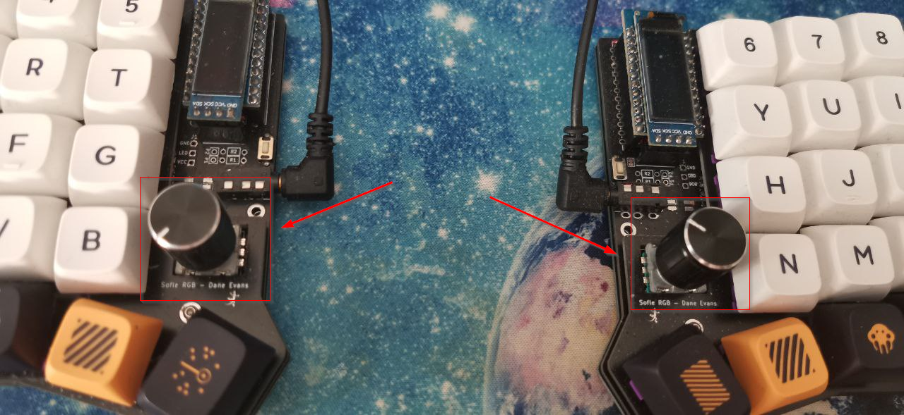

The process of soldering the encoders is very simple since they have very large pins and are not electronic components. The trick is to **bend the legs** so that the encoder is attached to the PCB and does not move during the soldering process.

## 13. Upper and lower plates

Once here, we are done with the soldering iron 👏. For this next step, we must place the screws and standoffs on the lower plate:

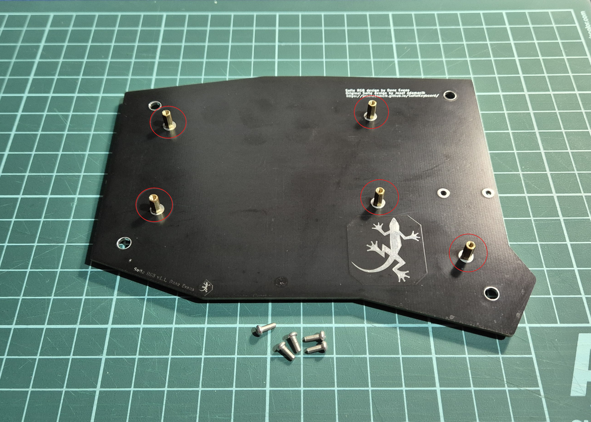

Now we must place our PCB so that the standoffs pass through it:

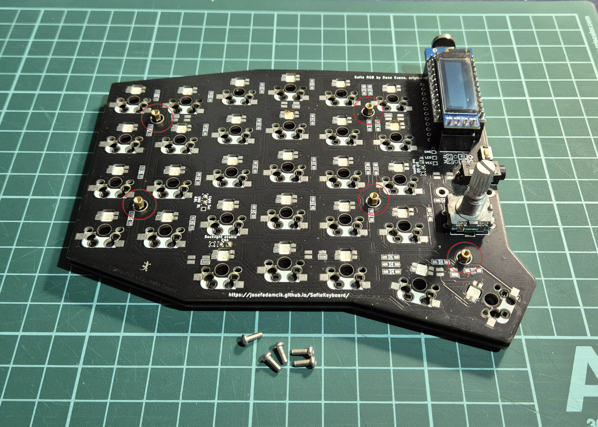

And finally, screw on the upper plate:

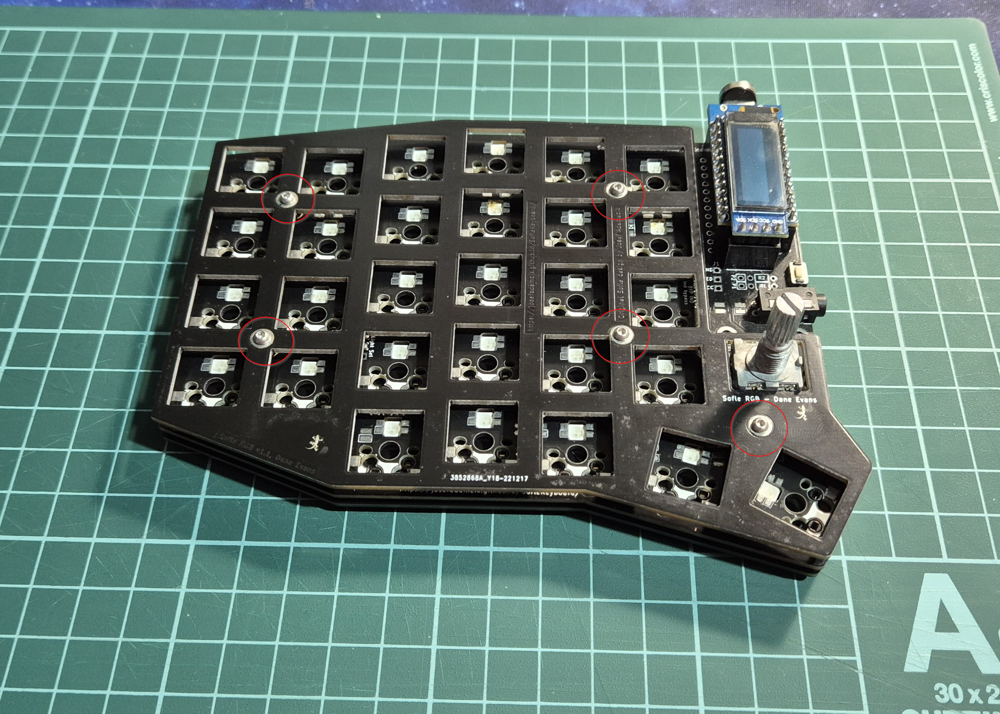

You will notice that the PCB is a little loose, but don't worry, this is normal and we will fix it in the next step.

## 14. Switches and KNOBs

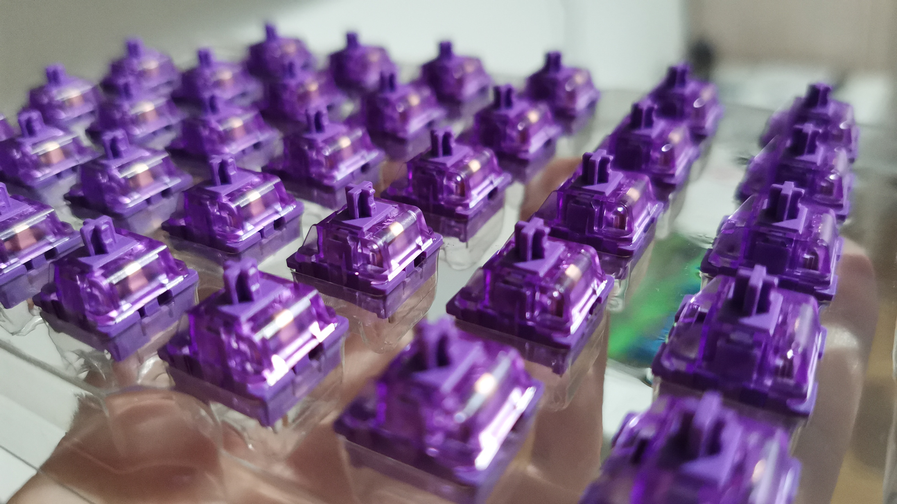

The next step is to place our switches in each slot, taking care not to bend any of the switch pins.

> ⚠️ Note that the switch located below the encoders is slightly rotated

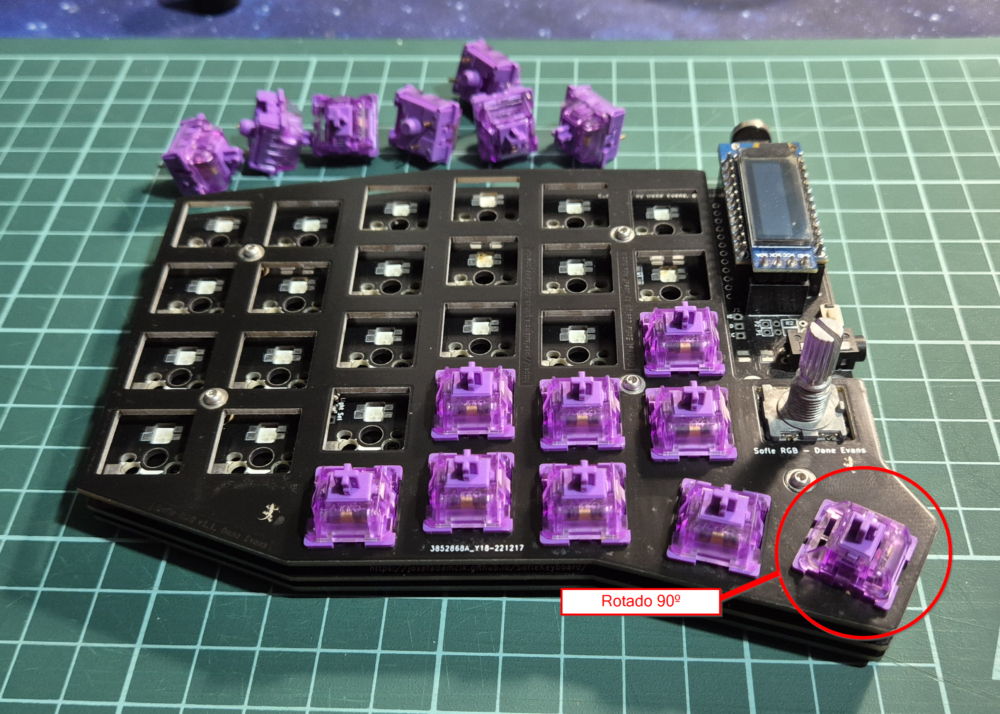

Once we have the switches in place, we can put the KNOBs, which are simply the knobs on top of the potentiometers:

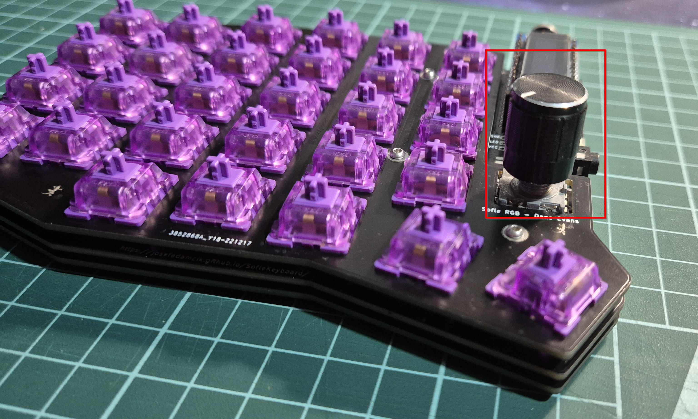

## 15. Keycaps

Now it's finally time for the most eye-catching part of any keyboard, the keycaps:

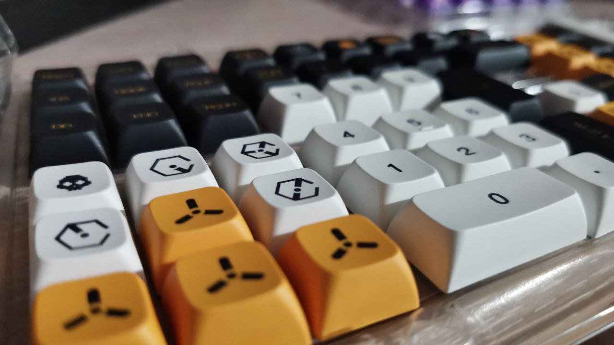

In my case, I purchased some keycaps on AliExpress that fit the keyboard perfectly. I recommend checking that the set of keycaps you are going to buy has enough keys (and the right size) for your keyboard.

To place the keycaps, simply press the keycap lightly onto the switch and fill it as desired:

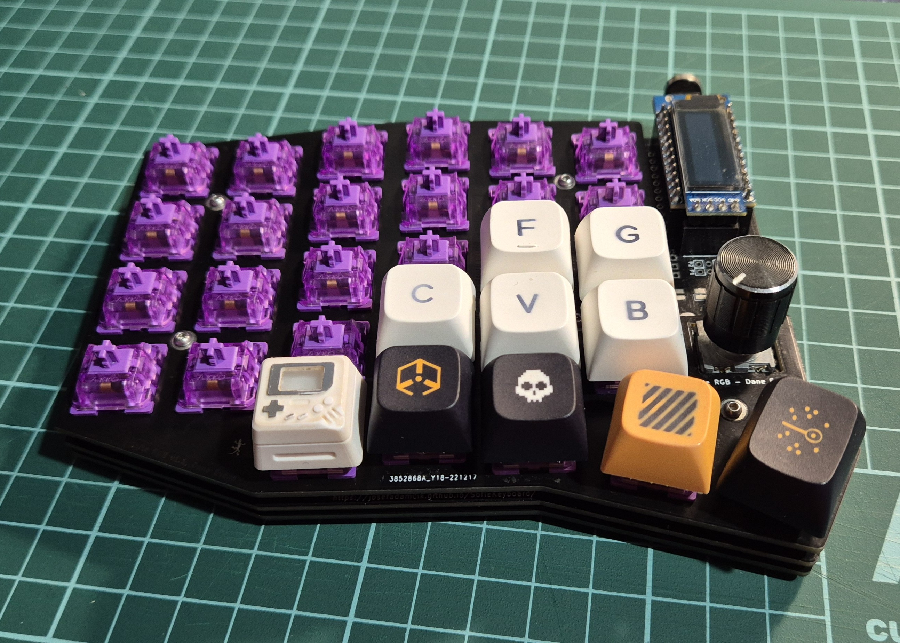

## 16. Rubber feet

Rubber feet prevent the keyboard from moving when in use. They are not mandatory, but highly recommended.

You can find them at any local store in your city.

The position of the rubber feet is entirely up to the consumer, but I recommend placing one on each corner and another in the middle, as shown below:

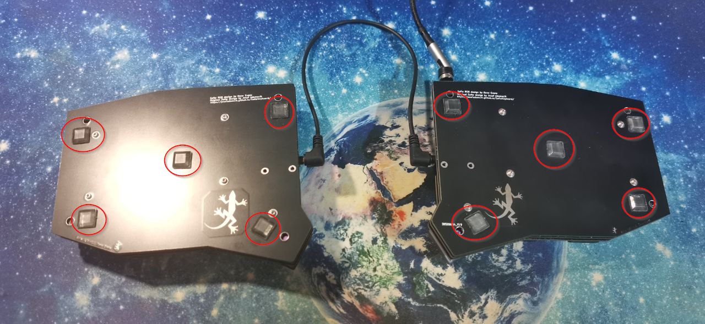

## 17. USB-C cable

The USB-C cable allows us to connect the keyboard to the computer. In my case, it is a USB-C cable because the promicro I purchased has that type of USB.

You can use any type of USB-C cable. In my case, I purchased a magnetic USB-C cable on AliExpress that fits the keyboard perfectly. The magnetic system is very convenient because it allows you to connect and disconnect the cable without having to force the connector. It also protects the keyboard connector in case of accidental pulling.

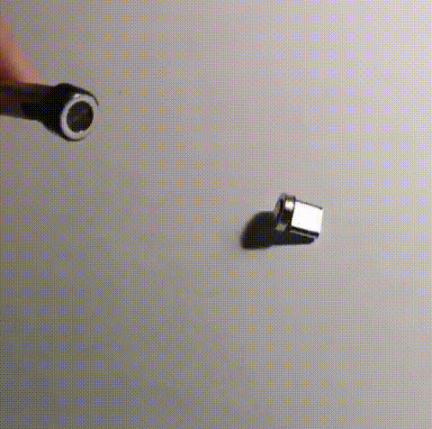

## 18. Case

The case is **completely optional**, but it complements the keyboard very well if you want to carry it around. In my case, I bought a case on AliExpress that fits the keyboard perfectly.

This case has a small pocket to carry all the cables and allows you to cut the foam to fit the keyboard perfectly:

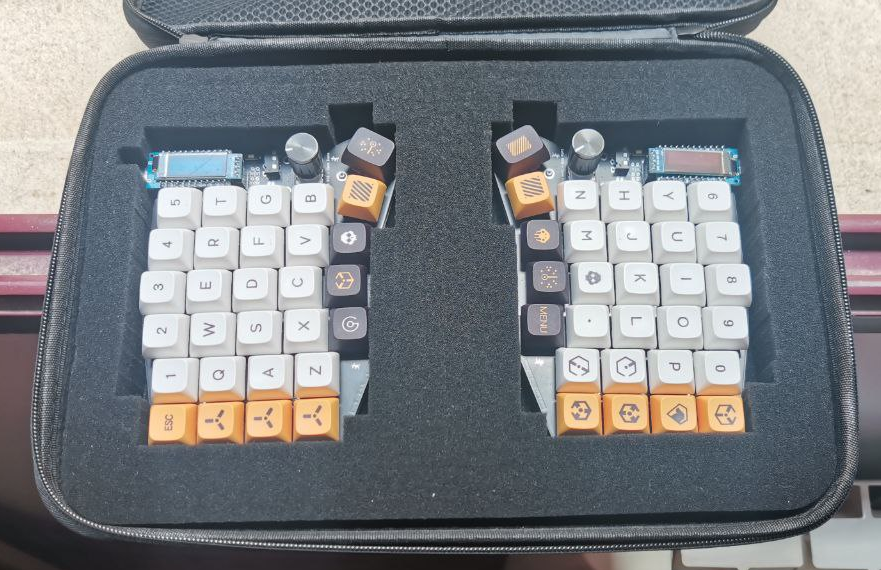

# The result

The result is what you have already seen in the introduction to this guide, but here it is again:

And so you can better appreciate the result, here is a short video of the keyboard in action:



---

# Troubleshooting

This section contains solutions to common errors (or at least those I have encountered) during keyboard assembly.

## 1. The Promicro does not turn on

This section focuses on trying to resolve the issue when the Promicro does not turn on when plugged into the PCB.

The first thing to do is to rule out that the Promicro in question is not defective. Checking this is as simple as unplugging the Promicro from the PCB, connecting the Promicro to any computer, and checking if the LED on the Promicro turns on. If the built-in LED does not turn on, the Promicro may be defective.

If the Promicro turns on when it is not connected to the PCB, but does not turn on when it is connected to the PCB, it is very likely that you have a **short circuit** on the PCB.

The next step is to look for that short circuit on our PCB. To do this, we must check all the solder joints one by one, verifying:

- That no component is soldered in a short circuit (a solder joint that touches two different pads)
- That no component is soldered in the wrong position (for example, a diode backwards). This is the most common reason, especially with LEDs.

If you can't find the problem, there is a little trick you can use to locate it. This trick involves using thermal paper (the kind used in cash registers) to cover the entire PCB. Short circuits usually occur where there is no resistance, causing the connection that causes the short circuit to become very hot.

If you can't find the problem, a useful trick to locate the fault is to cover the PCB with thermal paper (the kind used for cash registers), connect the Promicro to the PCB, and connect the keyboard to a computer. Since short circuits have no resistance, they generate intense heat that is transferred to the paper, allowing you to visually identify where the faulty component is located:

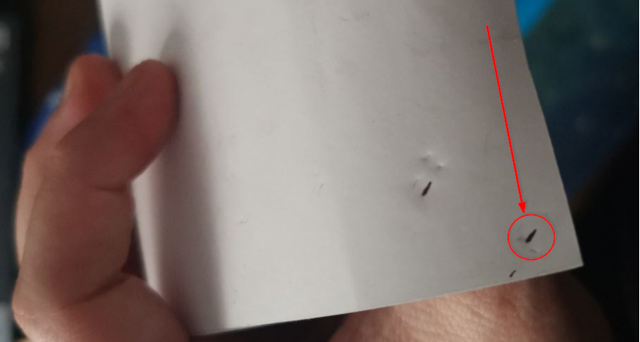

> ⚠️ Be very careful when doing this, as if the short circuit is very intense it can damage the copper tracks. Do not leave the keyboard connected for more than 1 or 2 seconds.

## 2. Only some LEDs work

If only some LEDs work, it is very likely that you have a poorly soldered LED.

To solve this problem, we must understand how the LEDs on our keyboard work. The LEDs on the *Sofle* are connected in series, which means that a poorly soldered LED will turn off the other LEDs in the series.

This series connection gives us a clue that the soldering error is located at one of these points:

- The LED output pin (DOUT) of the last LED that is lit
- The LED input pin (DIN) of the first LED that is off

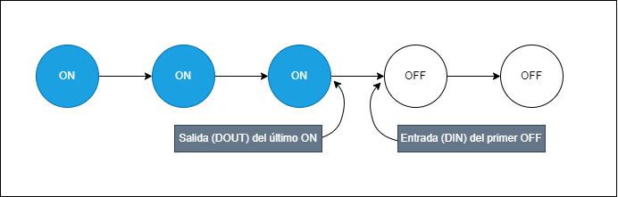

At this point, I just need to know the order of the LEDs, which is as follows:

# References

In this type of guide/project, there is never enough information, so here are a few links to external resources that will help you resolve any questions that are not answered in this guide:

- [Official Josefadamcik Guide](https://josefadamcik.github.io/SofleKeyboard/build_guide_rgb.html): This is the guide provided by the keyboard's creator.  
- [Official guide translated into Spanish](https://zonekeyboards.cl/assembly-sofle-rgb): This is the guide provided by the keyboard's creator, but translated into Spanish.  
- [Step-by-step guide with photos](https://docs.beekeeb.com/build-guide/sofle-rgb-v2.1-soflekeyboard-build-log-guide-with-photos): This is a guide like this one, but made by another user.  
- [PCB Gerbers](https://github.com/josefadamcik/SofleKeyboard/tree/master/Gerbers/RGB): Gerbers are files that allow us to see the PCB's internal connections and can be viewed using certain online software. I found them very helpful during the assembly process.  
- [Visual guide to good soldering practices](https://hacedores.com/13-problemas-de-soldadura-de-pcbs/): A visual guide to improving our soldering process and achieving a good finish.  
- [SMD component sizes](https://eulerprecision.com/es/nuestra-tarjeta-de-visita-para-ingenieros/): When purchasing components, we must be very careful with each one. This link can help you verify that the size of the components is really what you want.